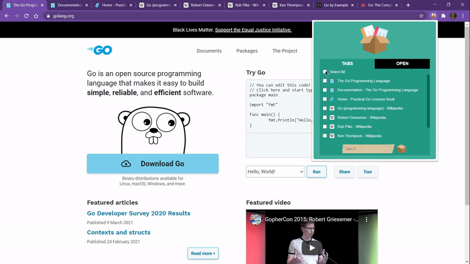

# Chrome-Tab-Saver

Tab Saver is a Chrome extension to save your tabs.

You can save your tabs if you want to take a break from a subject when you are using too many tabs related too many different subject. Then you can reopen them as a tab group and continue where you left off!

You can use it with a basic popup.
Your data is not stored at anywhere but your computer.
It's pure, secure and useful.
